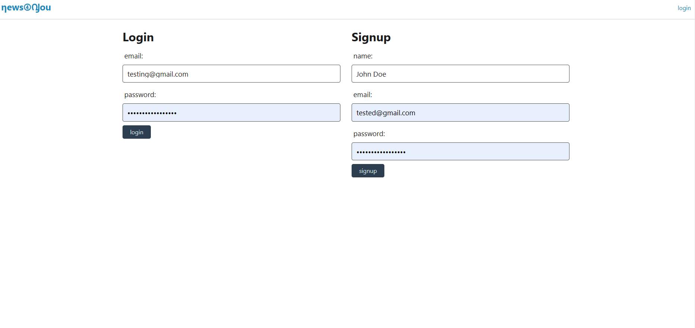
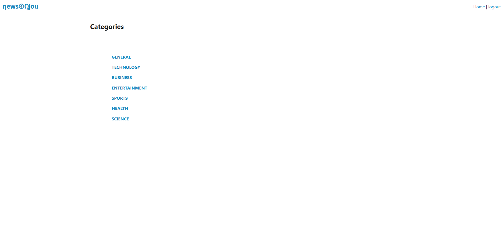
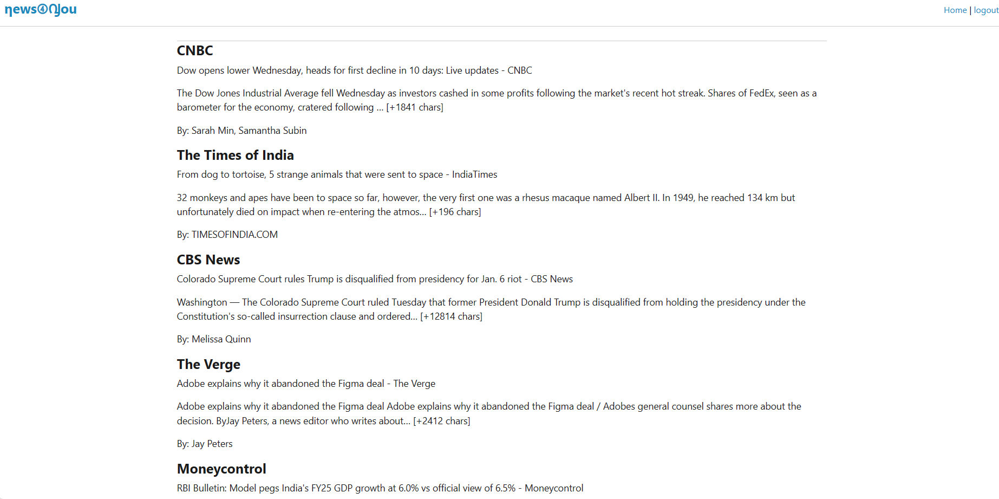
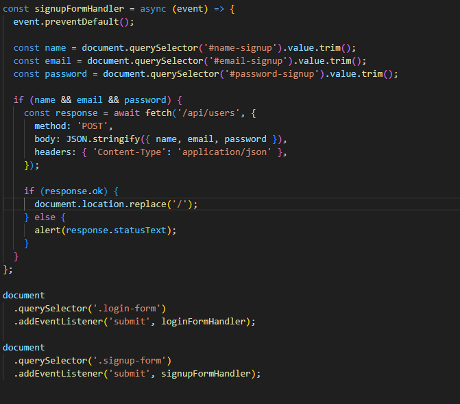
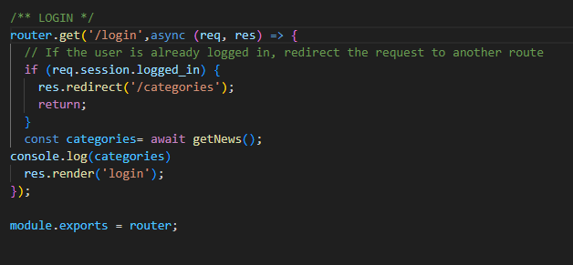
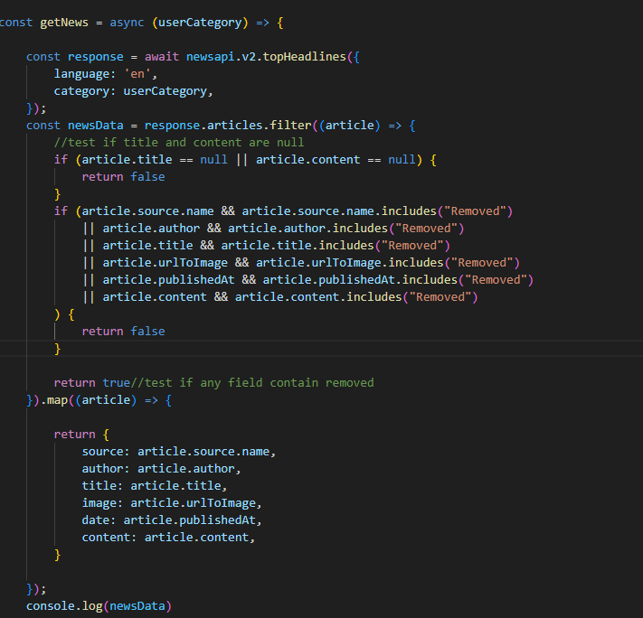
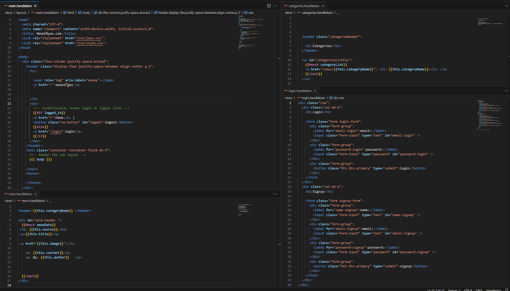

# Newspaper-Generator
## Description
Staying up to date on the current news can be challenging in this multimedia era. That's why we created Newspaper-Generator app.
The NewsPaper-Generator app is an online newspaper that provides users with news articles from multiple sources based on users' choosen category, saves user credentials to facilitate the login process.

## Table of Contents 

- [Webpage-Preview](#Webpage-Preview)
- [Code-Snippet](#Code-Snippet)
- [Installation](#Installation)
- [Usage](#Usage)
- [Skill-Improved](#Skill-Improved)
- [Technologies](#Technologies)
- [Authors](#Authors)
- [Credits](#credits)

## Webpage Preview

### Images

 

## Code-Snippet

### Funtion to Handle Form

### Function to  filter News Data

### Handlebars to display HTML

## Installation
Install Node.js. Clone the repo, run npm i for the dependencies.  Create an account on https://newsapi.org to get API key for Top Headlines. Create an .env file and add your database name, MySQL username, MySQL password, and API_KEYT as follows:

DB_NAME='newsgenerator_db' DB_USER='your_mysql_user' DB_PASSWORD='your_mysql_pw' API_KEYT='your_api_key'

Create a .gitignore file and add the following files:

node_modules  .DS_Store .env

To start the application, run: npm start.

## Usage
The link of the webpage is:  
Webpage use example:
    
https://newspaper-generator-app.onrender.com
    
## Skills Improved

- Setting up server enviroment.
- Database design
- Sequelize modeling
- Login security
- API handling
- Handlebars templating
- Filtering and mapping data

## Technologies
 - [HTML](#HTML)
 - [CSS](#CSS)
 - [JavaScript](#JavaScript)
 - [npm](#npm)
 - [Node.js](#node.JS)
 - [bcrypt](#bcrypt^5.0.0)
- [connect-session-sequelize](#connect-session-sequelize^7.0.4)
- [dotenv](#dotenv^8.2.0)
- [express](#express^4.17.1)
- [express-handlebars](#express-handlebars^5.2.0)
- [express-session](#express-session^1.17.1)
- [mysql2](#mysql2^2.2.5)
- [newsapi](#newsapi^2.4.1)
- [pg](#pg^8.11.3)
- [pg-hstore](#pg-hstore^2.3.4)
- [sequelize](#sequelize^6.3.5)
## License
  

## Authors

- [CarrTe-Alexander-(CJ)](#CarrTe Alexander (CJ) https://github.com/carrtealexander)
- [Carmen-Jimenez](#Carmen Jimenez https://github.com/clcoder2425/)
## Instructor Team
- [Justin Gottschalk](#CarrTe Alexander (CJ) https://github.com/carrtealexander)
- [Mitchell](#CarrTe Alexander (CJ) https://github.com/carrtealexander)

## Credits

- [W3School](W3School)
- [StackOverflow](https://stackoverflow.com)
- [News API](https://newsapi.org/docs/get-started)
- [Youtube](https://youtube.com)
- [Next-JS](https://nextjs.org/)
- [FreeCodeCamp](https://www.freecodecamp.org/)

